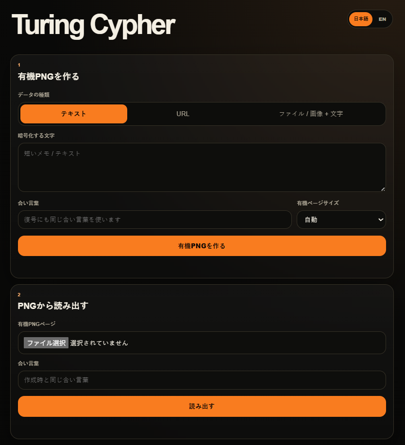

# DEM HIDDEN CYPHER

**DEM HIDDEN CYPHER** is a Turing Cypher / Turing Seal prototype.

It turns text, URLs, files, or image+text bundles into one or more organic PNG patterns.  
Each generated pattern contains both:

- the data itself
- a self-contained certificate layer: issuer, certificate ID, payload hash, public key, and digital signature

**Data and proof inhabit the same organic pattern.**

## Screenshot

`screenshot1.png` is included from the previous Turing Cypher build.  
Replace it later with a DEM HIDDEN CYPHER screenshot.

<p align="center">
  
</p>

## Concept

DEM HIDDEN CYPHER is not a QR code and not an NFT clone.

It is an organic proof container:

- visible pattern
- hidden data
- verified presence

The pattern can be saved or printed as a PNG. When read back, the app restores the content and shows whether the embedded certificate is valid.

## Current MVP Features

- Text / URL / File / Image + Text payloads
- Organic PNG generation using the existing Turing Cypher AP61 carrier
- AES-GCM encryption with PBKDF2-derived key
- `Public Pattern` mode
  - readable without a passphrase
  - still includes issuer signature and payload hash verification
- `Sealed Pattern` mode
  - content is sealed by a passphrase
  - certificate and payload are restored only with the passphrase
- Issuer identity
  - each browser generates an ECDSA P-256 issuer key pair
  - private key is kept in localStorage on that device
  - public key is embedded in the certificate for verification
- Certificate fields
  - issuer name
  - issuer ID
  - certificate ID
  - subject
  - issued date
  - payload SHA-256
  - ECDSA signature
- Reader shows
  - `VALID` / `INVALID`
  - issuer
  - certificate ID
  - proof status
  - payload hash status
  - recovered content

## Important Security Notes

This is a prototype and has not been independently audited.

The cryptographic protection comes from standard cryptographic primitives:

- AES-GCM for sealed payload encryption
- PBKDF2-SHA-256 for passphrase-based key derivation
- ECDSA P-256 for issuer signatures
- SHA-256 for payload hashing

The organic pattern is the carrier and expression layer. It should not be described as a new cryptographic primitive.

Use a strong passphrase for Sealed Pattern mode.

Good:

```text
tuna-river-orange-mirror-planet-needle
```

Weak:

```text
MASATO
password
1234
```

## File Handling Caution

The encoded content is carried by the **original PNG file**.

If the PNG is resized, recompressed, screenshotted, or reposted as a social media image, the content may be lost.

Recommended sharing methods:

- original PNG file download
- ZIP download
- email attachment
- GitHub / Cloudflare / web file hosting
- Google Drive / Dropbox / iCloud / OneDrive as original files

Avoid:

- screenshots
- JPEG conversion
- X / Instagram image reposts
- LINE / Messenger photo-mode compression

## Deploy

Cloudflare Pages:

```powershell
npx wrangler pages deploy . --project-name dem-hidden-cypher
```

If the project does not exist yet, Wrangler will ask to create it.

## Tags

```text
#PWA
#WebApp
#CreativeCoding
#GenerativeArt
#Encryption
#Steganography
#ReactionDiffusion
#GrayScott
#VibeCoding
#TuringCypher
#TuringSeal
#DEMHiddenCypher
```
